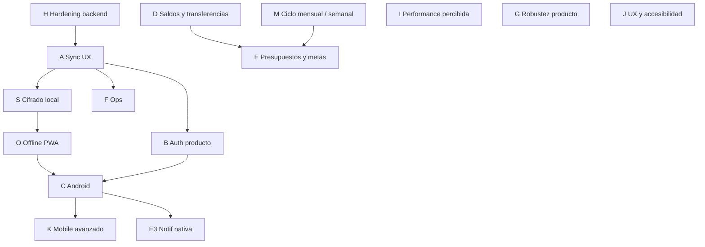

# Plan de implementación — OpenBalance

Fecha: 2026-07-17 (actualizado con análisis de producto + épicas de seguridad/offline; ampliado con hallazgos de 8 subagentes de exploración paralela — sección 8; sumada Fase M: ciclo mensual/semanal configurable)  
Repo: `YukaC/OpenBalance` · App: **OpenBalance**

Principios: **DRY**, **KISS**, sin dependencias nuevas sin preguntar, lógica de cálculo siempre en cliente, backend tonto (CRUD/sync).

---

## 1. Qué es el proyecto

OpenBalance es una app de finanzas personales para quien **cobra por semana** y **decide por mes** (freelancers, changas, trabajo informal). El nicho es claro: la mayoría de apps asumen sueldo mensual fijo; acá la unidad natural es la **semana de cobro** y el mes es el marco de resumen.

### Stack real (evolucionó del plan original)

| Capa | Hoy | Plan original (`implementacion.md`) |
|------|-----|-------------------------------------|
| UI | Next.js 15 App Router + TS + Tailwind 4 | Expo |
| Estado | Zustand + `localStorage` (local-first) | — |
| Auth/sync | Auth.js + Drizzle + Postgres (Neon), **opcional** | NestJS + Prisma + Auth0 |
| Móvil | Capacitor + PWA shell (`manifest`) | Expo nativo |

**Decisión:** monolito Next que funciona **100% sin backend** y suma sync como capa opcional. Para founder solo es la opción correcta: menos infra, mismo valor percibido.

### Estado actual

No estamos en “plan desde cero”. Estamos en **app funcional post-auditoría**:

- `analisis.md` marcada **CERRADA** (must-fix / should-fix remediados).
- `AuditLogic.md` + fixes de ledger (pay-weeks, dedupe, soft-delete).
- Auth/sync en producción (`open-balance-delta.vercel.app`), auto-sync (login / idle 10m / leave dirty-only).
- Capacitor scaffolding + docs deploy/mobile.

Typecheck / lint / tests de dominio en verde.

### Épicas que la auditoría dejó fuera a propósito (ahora entran al plan)

| Épica | Por qué importa |
|-------|-----------------|
| **Cifrado de datos locales con PIN** | Hoy el PIN es solo gate de UI; el ledger queda en texto plano en el navegador. Hueco de seguridad más serio. |
| **Service Worker / offline PWA real** | Hay manifest/shell, pero sin SW no hay app-shell cacheado ni offline genuino — raro para “cargar un gasto en el momento”. |
| **Virtualización de listas** | No urge hoy; con meses de uso real Transacciones puede pesarse. |

---

## 2. Objetivo de este plan

Llevar OpenBalance de “MVP con cuenta y sync básico” a un producto **seguro en el dispositivo**, **usable offline**, con **Android instalable**, sync predecible y finanzas (saldos/transferencias) — sin sobre-ingeniería (&lt; 10 usuarios).

---

## 3. Mapa de fases

| Fase | Nombre | Prioridad | Esfuerzo | Depende de |
|------|--------|-----------|----------|------------|
| **H** | **Hardening rápido backend/seguridad** | **P0, quick wins** | S | — (independiente, hacer ya) |
| A | Sync UX + resiliencia | P0 | S | — (parcialmente hecho) |
| **S** | **Cifrado local + PIN real** | **P0 seguridad** | M | A4 recomendable |
| **O** | **Offline PWA + cola de mutaciones** | **P0 producto** | M | A1, S ( Ideal: cifrar antes de IDB) |
| B | Cuentas (auth producto) | P0 | M | — |
| C | Android instalable | P1 | M | B + sesión WebView; O ayuda |
| **K** | **Mobile nativo avanzado** (back button, backup, biometría) | P1–P2 | M | C |
| D | Saldos y transferencias | P1 | M–L | — |
| **I** | **Performance percibida** (resumen, bundle, buscador) | P1–P2 | M | — |
| E | Presupuestos / metas / notif nativa | P2 | M | D parcial, C para E3 |
| **J** | **UX / accesibilidad** (undo, validación, foco) | P2 | S–M | — |
| **G** | **Robustez de producto** (clasificador, PDF, FX, virtualización) | P2 | M | Uso real justifica timing |
| **M** | **Ciclo mensual / cobro semanal configurable** | **P1 producto** | M–L | — (afecta E1, G6) |
| F | Ops / calidad | P2 | S–M | A |

---

## Fase A — Sync UX + resiliencia (P0)

### A1. Indicador de sync en UI
- Chip/estado: `Sincronizado` | `Pendiente` | `Sincronizando…` | `Error` / `Sin conexión`.
- Un solo `syncStatus` derivado de `lastSyncedAt` + `hasPendingLocalChanges` + in-flight.
- **Done when:** tras editar se ve Pendiente; tras sync OK, Sincronizado.

### A2. Flush leave (hecho — verificar en prod)
- Dirty-only + `keepalive` en `visibilitychange` / `pagehide`.
- **Done when:** smoke desktop + mobile web.

### A3. Conflictos visibles (LWW con aviso)
- Toast si se descarta cambio local más viejo: “Se aplicó la versión más reciente de la nube”.
- Sin UI de merge manual.
- **Done when:** dos pestañas, gana el más nuevo + aviso.

### A4. Migración persist `v2 → v3`
- Migrar persist a `openbalance-finance-v3` + `ensureLifecycle` (prefijo `openbalance-*`).
- **Done when:** datos locales previos no se pierden al subir de versión.

### A5. Fix clock-skew en `isChangedSince` (🔴 riesgo de pérdida silenciosa de datos)
- Hoy `touch()` marca `updatedAt` con el reloj del **cliente**, pero se compara contra `lastSyncedAt` que viene del reloj del **servidor** (`sync-client.ts`). Si el reloj del cliente va atrás, una edición recién hecha puede quedar con `updatedAt <= lastSyncedAt` y nunca subirse — sin error visible.
- Fix: usar siempre `serverTime` como única fuente de verdad para el cursor, o versionar entidades con un contador monotónico en vez de timestamp de reloj de pared.
- **Done when:** test que simula reloj de cliente atrasado y confirma que la edición se sube igual.

### A6. Listener `online` + retry con backoff fuera del login
- Hoy solo hay reintentos en `syncOnLoginWithRetry`; si se pierde red mientras se edita, no hay retry hasta el idle timer (10 min) o el próximo leave.
- Agregar `window.addEventListener("online", ...)` en `auto-sync.ts` que dispare sync inmediato si hay cambios pendientes.
- **Done when:** offline → editar → reconectar → sync sin esperar 10 min.

### A7. Evitar eco de cambios propios en el pull
- `collectOutgoingChanges` usa el `lastSyncedAt` previo al request, así que el servidor devuelve al cliente las entidades que ese mismo cliente acaba de subir en la misma request. Esto dispara `onStoreChanged` y reprograma el idle timer sin necesidad.
- Fix: calcular el cursor de salida usando el timestamp de **inicio** de esta request como `since`, y excluir explícitamente lo recién aplicado en `applyIncomingChanges`.
- **Done when:** un sync sin cambios remotos reales no dispara `onStoreChanged`.

### Entregable
PR: `feat/sync-status-and-legacy-migrate` (+ `fix/sync-clock-skew-and-echo` para A5/A6/A7)

---

## Fase H — Hardening rápido backend/seguridad (P0, quick wins)

> Hallazgos de los subagentes de Seguridad y Backend/API. Todos son de esfuerzo bajo/medio y alto retorno; no requieren esperar a otras fases. Hacer antes o en paralelo a Fase S.

### H1. CI nunca ejecuta `pnpm test` (🔴 el más barato de arreglar, el de mayor apalancamiento)
- `.github/workflows/ci.yml` solo corre `typecheck`, `lint` y `build`. Los tests existentes (`summaries`, `format`, `backup`, `dates`, `classifier`) no protegen ningún PR hoy.
- **Done when:** agregar step `pnpm test` al workflow; falla el CI si un test rompe.

### H2. Sync transaccional en el servidor
- `applyIncomingChanges` hace decenas de queries secuenciales fuera de `db.transaction()`. Un fallo a mitad de sync deja estado parcialmente aplicado.
- **Done when:** envolver `applyIncomingChanges` en `db.transaction(...)`.

### H3. Rate limiting en login / register / sync
- Sin throttling por IP/email en `authorize()`, `register` ni `/api/sync`. Abre la puerta a brute-force de password y a llenar la tabla `users` con cuentas basura.
- Implementación simple (contador in-memory o Upstash Ratelimit si se aprueba dependencia) — **pedir OK** antes de sumar librería.
- **Done when:** N intentos fallidos por IP/email en X minutos → 429.

### H4. Límite de tamaño de payload en `/api/sync`
- `request.json()` sin límite explícito; un payload gigante se carga íntegro en memoria antes de tocar la DB.
- **Done when:** chequeo de `content-length` (ej. tope 2-5 MB) → 413 si excede.

### H5. No enumerar cuentas existentes en `/api/auth/register`
- Hoy devuelve `409 "Email already registered"` de forma explícita, permitiendo confirmar qué emails están registrados.
- **Done when:** mensaje genérico ("si el email es válido, te llega un correo") o flujo de verificación por email antes de confirmar existencia.

### H6. Validar `AUTH_SECRET` al boot (mismo patrón que `DATABASE_URL`)
- Ya existe `isDatabaseConfigured()`; replicar el patrón para `AUTH_SECRET` en vez de depender del fallback silencioso de NextAuth.
- **Done when:** boot sin `AUTH_SECRET` falla con mensaje claro, no 500 opaco.

### H7. Sanitizar logs de error de sync
- `console.error("[sync]", error)` loguea el objeto completo, potencialmente con fragmentos de datos financieros del usuario si Drizzle serializa detalles del payload en el mensaje de error.
- **Done when:** loguear solo `error.message`/código + `userId`, nunca el payload.

### H8. Health-check endpoint
- No existe `GET /api/health`. Útil para monitoreo externo (UptimeRobot, cron de Vercel) sin depender de un login real.
- **Done when:** endpoint que hace `SELECT 1` (o `isDatabaseConfigured()`) y devuelve estado + latencia.

### H9. CSP sin `unsafe-inline`/`unsafe-eval`
- `next.config.ts` tenía `script-src 'self' 'unsafe-inline' 'unsafe-eval'`, que anulaba gran parte del valor de la CSP contra XSS.
- **Estado (2026-07-16):**
  - **SSR (Vercel):** `src/middleware.ts` genera nonce por request; `script-src` producción = `'self' 'nonce-…' 'strict-dynamic'` — **sin** `unsafe-inline` ni `unsafe-eval`. Layout lee `x-nonce` y lo aplica al script de tema. `style-src` sigue con `unsafe-inline` (Tailwind).
  - **Export Capacitor:** middleware no corre (`build-mobile` lo aparta); `next.config` mantiene CSP estática con `unsafe-inline` en scripts.
  - **Partial win documentado:** `unsafe-inline` eliminado de `script-src` en el path SSR; no en export estático ni en `style-src`.

### H10. Migraciones: pasar de `db:push` a `db:generate` + `db:migrate` en producción
- `docs/DEPLOY.md` documenta `db:push` como flujo día a día contra Neon en prod. `drizzle-kit push` puede pedir un diff destructivo (drop+recreate) en cambios de columna con datos existentes — el riesgo de pérdida de datos real más alto del roadmap operativo.
- **Done when:** `db:push` reservado solo a desarrollo local; prod usa `db:generate` + revisión manual del SQL + `db:migrate`.

### Entregable
PR: `chore/backend-hardening` (agrupar H1, H5, H6, H7, H8 — bajo esfuerzo) + `fix/sync-transaction-and-ratelimit` (H2, H3, H4)

---

## Fase S — Cifrado local + PIN real (P0 seguridad)

> Incorporado del análisis externo: el PIN actual **no cifra**; es el hueco más serio.

### S1. Cifrado at-rest con Web Crypto
- AES-GCM; clave derivada del PIN con **PBKDF2** (Web Crypto nativo; Argon2 solo si se aprueba una lib).
- Cifrar el blob de persistencia **antes** de escribir.
- Migración: detectar plaintext → pedir PIN → re-persistir cifrado en el primer unlock post-update.
- **Invariante:** el PIN **nunca** viaja al server ni se incluye en `/api/sync`.

### S2. Mover blob cifrado a IndexedDB
- Más espacio y mejor para binarios que `localStorage`.
- Zustand persist custom storage adapter (async).
- Mantener key versionada (`openbalance-finance-v4` o namespace IDB bajo `openbalance-*`).

### S3. UX de desbloqueo
- `PinUnlockScreen` ya existe: debe **desbloquear la clave de cifrado**, no solo ocultar UI.
- Sin PIN configurado: comportamiento actual (opcional); documentar que sin PIN = sin cifrado.

### S4. Biometría como upgrade opcional (Android/iOS, post-Capacitor)
- Plugin: `@aparajita/capacitor-biometric-auth` (ya en `package.json`; alternativa `@capacitor/biometric` descartada).
- Desbloqueo con huella/Face ID en vez de tipear el PIN cada vez; el cifrado real sigue delegando en la clave derivada del PIN (S1) vía `unlockWithPin`.
- UI: toggle en `PinSection` / Configuración; auto-prompt + botón en `PinUnlockScreen`.
- Solo aplica al build nativo (Capacitor); en web / sin plugin → no-op seguro (`biometric-unlock.ts`).
- **Done when:** en Android/iOS, "Desbloquear con huella" pide el PIN una vez y después ofrece biometría.

### Entregable
PR: `feat/encrypted-local-store`  
Docs: README — dejar de decir “PIN no cifra” cuando esté hecho.

---

## Fase O — Offline PWA real (P0 producto)

> Manifest existe; falta Service Worker y cola offline alineada al sync actual.

### O1. Service Worker (Workbox / next-pwa — **pedir OK de dep**)
- Cache app-shell + assets estáticos.
- Network-first o stale-while-revalidate para navegación SPA.
- **Done when:** abrir la app sin red muestra shell y datos locales ya hidratados.

### O2. Cola de mutaciones offline
- Extender el patrón push/pull: cola en IndexedDB de cambios pending → replay al `online`.
- Reusar `hasPendingLocalChanges` / auto-sync; no inventar segundo motor.
- **Done when:** crear gasto offline → al recuperar red, sync sin botón.

### O3. Indicador “sin conexión / cambios pendientes”
- Solapa con **A1**; unificar en el mismo chip (no dos badges).

### O4. Chunking del `keepalive` fetch al cerrar pestaña
- `flushPendingOnLeave` envía el payload completo con `keepalive: true`, pero Chrome/Firefox limitan ese body a ~64KB; con varios cambios pendientes el request puede truncarse silenciosamente.
- **Done when:** si el payload estimado supera un umbral seguro (ej. 50KB), partir en múltiples requests `keepalive` más chicos o priorizar solo lo más reciente.

### Entregable
PR: `feat/pwa-offline-queue`  
Actualizar `docs/MOBILE.md` / README PWA.

---

## Fase B — Cuentas / auth producto (P0)

### B1. Recuperar contraseña
- Token en Postgres + email (Resend/Nodemailer — pedir OK).
- UI en `AuthScreen`.
- **Done when:** reset por mail → nuevo password → login.

### B2. Cambio de email / password logueado
- Sección en Configuración; password actual requerido.

### B3. Export/import cloud-ready
- Round-trip `updatedAt` / `deletedAt`; CSV sin soft-deleted.

### Entregable
PR: `feat/password-reset-and-account-settings`  
`docs/DEPLOY.md`: vars SMTP/Resend.

---

## Fase C — Android instalable (P1)

### C1. Sesión Capacitor ↔ Vercel
- Cookies / `AUTH_URL` / SameSite; fallback JWT en Preferences + `Authorization` si hace falta.

### C2. Pipeline build
- `pnpm build:mobile` → `cap:sync` → APK/AAB firmado.

### C3. Banner “Descargá la app”
- `NEXT_PUBLIC_ANDROID_DOWNLOAD_URL` (y iOS después).

### Entregable
PR: `feat/android-webview-auth`

---

## Fase K — Mobile nativo avanzado (P1–P2, depende de C)

> Hoy el APK/IPA es esencialmente un WebView de la PWA sin ningún plugin Capacitor más allá de `core`/`android`/`ios`. Estos ítems cierran gaps de "sensación nativa" y de funciones que dependen de APIs web poco confiables dentro de un WebView.

### K1. Backup export/import nativo
- `downloadJsonFile` usa `Blob` + `<a download>`, que casi no funciona en WebViews de Capacitor (sin diálogo de guardado ni acceso a filesystem). Es la única red de seguridad de datos locales.
- `@capacitor/filesystem` + `@capacitor/share` como fallback nativo — **pedir OK** de dependencias.
- **Done when:** exportar/restaurar backup funciona en el APK, no solo en navegador.

### K2. Back button de Android
- No hay `@capacitor/app` instalado ni listener de `backButton`; hoy el botón físico atrás probablemente cierra la app en vez de navegar hacia atrás dentro de la app o cerrar el form abierto.
- **Done when:** back button navega por secciones/cierra modales antes de salir de la app.

### K3. Splash screen + iconos completos
- `manifest.webmanifest` y el `<link>` de Apple apuntan ambos al mismo SVG único; no hay PNGs rasterizados (192/512) ni maskable, ni `@capacitor/splash-screen` configurado.
- **Done when:** iconos PNG maskable + splash de marca en el build nativo.

### K4. Haptics en interacciones clave
- `@capacitor/haptics` en el FAB "Nueva transacción" y confirmaciones de guardado — pulido barato de sensación nativa.

### K5. Safe-area izquierda/derecha
- Hoy solo `--safe-top`/`--safe-bottom`; falta `env(safe-area-inset-left/right)` para landscape con notch/dynamic island.

### K6. Deep linking (post Fase E3)
- Sin URL scheme/intents configurados. Relevante una vez que las notificaciones nativas de día de cobro (E3) existan: tocar la notificación debería abrir directo el form de ingreso, no solo la app en Resumen.

### Entregable
PR: `feat/capacitor-native-plugins` (K1, K2 primero — mayor impacto funcional; K3-K6 son pulido)

---

## Fase D — Saldos y transferencias (P1)

### D1. Saldo por cuenta
- `sumByAccount` por moneda de la cuenta; saldo = ledger activo completo (copy claro).

### D2. Transferencias
- Par linkeado (`transferGroupId`); soft-delete ambas legs; sync normal.

### D3. Filtro por cuenta (opcional)
- En Transacciones / Resumen.

### D4. Vista agregada de deuda en cuotas pendientes
- Los datos ya existen (`installmentGroupId`, `installmentIndex`, `installmentCount`), pero ninguna vista muestra "cuánto te queda por pagar" agregado por serie/tarjeta.
- Nueva función en `summaries.ts` que agrupe por `installmentGroupId` las cuotas futuras y sume su monto + un widget simple en Resumen o Configuración.
- **Done when:** vista muestra, por tarjeta/serie, cuotas restantes y monto total pendiente.

### Entregable
PR: `feat/account-balances-and-transfers`

---

## Fase M — Ciclo mensual / cobro semanal configurable (P1 producto)

> El posicionamiento actual (`§1`) asume que **todo** usuario cobra por semana y decide por mes. Es un buen diferencial de nicho (freelancers/changas), pero deja afuera al usuario mayoritario que cobra sueldo mensual fijo y para quien la semana de pago no significa nada. Un switch de cadencia en Configuración, **mensual por default**, resuelve esto sin perder el diferencial semanal para quien lo necesita.
>
> **Hallazgo clave explorando el código:** el camino de filtrado por mes calendario (`filterByMonth`) **ya existe** en `summaries.ts` — hoy se usa solo como fallback cuando `getMonthWorkWeeks` no devuelve semanas. La Fase M no inventa un modelo temporal nuevo; promueve ese camino a primera clase cuando `payCadence === "monthly"` y deja el modelo de pay-week intacto para `"weekly"`. Esto mantiene el diff acotado (DRY/KISS) en vez de bifurcar toda la capa de dominio.

### M1. `payCadence` en `UserProfile` + columna de sync
- Nuevo campo `payCadence: "monthly" | "weekly"` en `UserProfile` (`src/lib/types.ts`), default `"monthly"`.
- Columna Postgres additiva (mismo patrón que `H10` / `drizzle/0001_add_missing_prod_columns.sql`): `pay_cadence text not null default 'monthly'`. `db:generate` + revisión manual + `db:migrate`, nunca `db:push` directo en prod.
- **Migración de usuarios existentes (crítico, no trivial):** todo perfil que ya tiene `paydayWeekday` seteado explícitamente por el usuario (no el default de seed) debe migrar a `payCadence: "weekly"`, no a `"monthly"`, para no cambiarle el modelo de un día para el otro a quien ya vive en semanas de pago. Perfiles nuevos post-deploy arrancan en `"monthly"`.
- **Done when:** perfil nuevo → `"monthly"`; perfil con `paydayWeekday` ya usado → conserva `"weekly"` tras la migración, sin acción del usuario.

### M2. `month-index.ts` / `summaries.ts`: bifurcar por cadencia, no reescribir
- `getMonthTransactions` (único punto de entrada usado por `ResumenView`/`TransaccionesView`) recibe `payCadence` y decide: `"monthly"` → `filterByMonth` (calendario, ya existe) como camino primario; `"weekly"` → `filterByMonthPayWeeks` (comportamiento actual, sin cambios).
- `buildMonthSummary`: en modo `"monthly"`, `weeks` se calcula igual (no rompe el tipo) pero pasa a ser metadata secundaria, no la fuente de verdad del total del mes.
- **Done when:** con `payCadence = "monthly"`, el total de Resumen coincide con el mes calendario (1 al 30/31), no con la ventana de pay-weeks.

### M3. Config: extender `PaydaySection` con el selector de cadencia
- Selector "¿Cómo cobrás?" → **Mensual** (default) | **Semanal**, arriba del selector de día.
- Modo `"monthly"`: día de cobro del mes (1–28 o "Último día"), en vez de día de la semana.
- Modo `"weekly"`: UI actual sin cambios (día de semana + `lede` existente).
- **Done when:** cambiar el switch reordena el resto de la sección sin perder el valor ya guardado del modo anterior (no se pisan entre sí).

### M4. `ResumenView` / `WeekBreakdown` / `MonthComparisonChart`: colapsar la semana en modo mensual
- En `"monthly"`, `WeekBreakdown` pasa a bloque colapsable opcional ("Ver desglose semanal"), no al frente como hoy.
- `MonthComparisonChart` compara mes contra mes en ambos modos (ya lo hace por `monthKey`; no requiere cambios de fondo, solo verificar que no dependa implícitamente de pay-weeks).
- **Done when:** en modo mensual, Resumen abre mostrando ingreso/gasto/saldo del mes primero; la semana queda un clic más lejos.

### M5. `payday-reminder.ts`: soportar día-del-mes, no solo día-de-semana
- Hoy `isPaydayDate`/`shouldShowPaydayLoadReminder`/`syncNativePaydayNotification` solo entienden `Weekday`. En modo `"monthly"` el "día de cobro" es un número de mes (o "último día").
- Comparte heurística con **G6** (detección de ingreso recurrente mensual por día-del-mes) — implementar la función de "es hoy el día de cobro" una sola vez y que la reutilicen `payday-reminder.ts` y la auto-proyección de G6, en vez de dos heurísticas paralelas.
- **Done when:** con `payCadence = "monthly"` y día de cobro = 30, el banner/notificación dispara el día 30 (o último día del mes si el mes tiene menos días).

### M6. Onboarding: paso de cadencia antes que moneda
- `OnboardingScreen` ya pisa `paydayWeekday` con el default de seed; agregar paso "¿Cómo cobrás?" (Mensual default | Semanal) antes de moneda, coherente con `M1`.
- **Done when:** un usuario nuevo elige el modo en el onboarding y `PaydaySection` arranca ya configurada así.

### M7. `E1` (presupuesto por semanas) se adapta a la cadencia
- Con `payCadence = "monthly"`, las barras/alertas de presupuesto (`E1`, `findBudgetAlerts`) deben leer contra el mes calendario, no contra `weeks` de pay-week. Con `"weekly"` sigue como está planeado en `E1`.
- **Done when:** implementar `E1` después de `M2`, no antes, para no construirlo dos veces.

### Entregable
PR: `feat/pay-cadence-monthly-default` (M1, M2, M3) + `feat/pay-cadence-ui-and-reminders` (M4, M5, M6)  
Docs: `README.md` — reescribir `§1` (posicionamiento) para reflejar "mensual por default, semanal opcional" en vez de "cobra por semana" como única premisa.

---

## Fase I — Performance percibida (P1–P2)

> Del subagente de performance: el código está en buen estado general (selectors por slice, `useMemo`, code-splitting por vista), pero hay recomputación redundante que se nota con historiales largos.

### I1. Índice mensual para `summaries.ts` (evitar recomputación O(semanas×N))
- `buildMonthSummary`/`findBudgetAlerts`/`findCategorySpendAlerts`/`getHormigaDrainAlert` re-escanean el historial completo de transacciones varias veces por render de `ResumenView` (~8-10 recorridos completos).
- Pre-filtrar transacciones del mes una sola vez (o mantener un índice `Map<monthKey, Transaction[]>` derivado) y pasar ese subconjunto a las funciones derivadas.
- **Done when:** con miles de transacciones, cambiar de mes o editar no genera jank perceptible.

### I2. Persist asíncrono / throttled (ligado a S2/O2)
- Cada mutación serializa el store completo a `localStorage` de forma síncrona en el hilo principal. Se resuelve naturalmente al mover a IndexedDB (Fase S2), pero si eso se demora, un throttle/debounce en el adapter de `persist` es un parche rápido.
- **Done when:** escribir varias transacciones seguidas no bloquea la UI de forma perceptible.

### I3. Code-split `TransactionForm` / `OnboardingScreen`
- A diferencia de las vistas principales (ya con `dynamic()`), `TransactionForm` (~780 líneas) se importa de forma eager en `AppShell` aunque solo se renderiza cuando `isFormOpen`.
- **Done when:** `dynamic(() => import(...))` para `TransactionForm` y `OnboardingScreen`; medir reducción de bundle inicial (relevante para el build estático de Capacitor).

### I4. Debounce en el buscador de Transacciones
- `searchQuery` recalcula el filtro completo en cada carácter tipeado, sin debounce.
- **Done when:** ~150-200ms de debounce antes de recalcular `filtered`.

### I5. `repairTransactions()` una sola vez por sesión
- Se ejecuta tanto en `onRehydrateStorage` como en cada mount de `ResumenView`, sin bandera de "ya reparado en esta sesión".
- **Done when:** bandera en memoria evita la segunda pasada redundante.

### Entregable
PR: `perf/monthly-summary-index-and-bundle-split`

---

## Fase E — Presupuestos / metas (P2)

### E1. Presupuesto alineado a semanas de pago
- Barras + breakdown por `buildMonthSummary.weeks`.

### E2. Meta de ahorro mensual
- `monthlySavingsGoal` en profile + sync; progreso en Resumen.

### E3. Notificaciones nativas día de cobro
- Capacitor Local Notifications; reusar `payday-reminder.ts`.

### Entregable
PR: `feat/budget-weeks-and-savings-goal`

---

## Fase G — Robustez de producto (P2, según uso real)

> Del análisis: no gastar esfuerzo prematuro; activar cuando el uso lo justifique.

### G1. Clasificador v2 — memoria por usuario
- Ya hay keywords + `userRules` / `rememberCategoryCorrection`.
- Regla: si el usuario corrige la misma categoría N veces (ej. 2) para un patrón, **override personal pisa global**.
- Barato, sin ML. Tabla/reglas ya casi existen — endurecer umbral + UI.
- **Done when:** “Rappi” corregido 2× → sugerencia estable a esa categoría.

### G2. Import resumen de tarjeta (PDF)
- CSV con dedup ya existe (S5 / `csv-io`).
- Extender: extraer texto de PDF de resumen (lib liviana — **pedir OK**) → mismas filas que CSV.
- **Done when:** subir PDF genera borrador de gastos revisable antes de confirmar.

### G3. Virtualización de lista de transacciones
- Solo si el volumen duele (umbral ej. &gt; 300 filas visibles).
- `react-window` / similar — **pedir OK** de dep.
- **Done when:** scroll fluido en meses densos; no meter antes.

### G4. Multi-moneda consolidada (manual)
- Hoy: no sumar ARS+USD (correcto).
- Siguiente: tasa de cambio **configurable a mano** (no API externa frágil en AR).
- Vista “equivalente en moneda default”.
- **Done when:** usuario setea tasa; Resumen puede mostrar total convertido con disclaimer.

### G5. Clasificador: ranking por especificidad, no por orden de array
- Hoy gana el primer match en el orden en que están las categorías/keywords, no el más específico (ej. "super" matchea tanto "Supermercado" como "Superclub", gana el que esté primero).
- Ordenar candidatos por longitud de keyword/patrón antes de devolver el match.
- **Done when:** dos keywords que matchean el mismo texto, gana la más específica (más larga) o la de `userRules` sobre la global (ya es así).

### G6. Ingreso recurrente: auto-proyección (paridad con gasto fijo)
- `IncomeSource.isRecurring` hoy solo evita que vuelva a sugerirse el hint; a diferencia de `Transaction.isFixed` (que sí se auto-proyecta cada mes), el ingreso recurrente nunca se genera solo — el usuario sigue cargando cada sueldo a mano.
- Además, la detección de recurrencia de ingreso exige coincidencia de **día de la semana**, lo cual no sirve para un ingreso mensual pagado un día fijo del mes (ej. día 30). Sumar detección por día-del-mes para fuentes `"mensual"`.
- **Done when:** marcar un ingreso mensual como recurrente ofrece auto-cargarlo (con confirmación) el mes siguiente, igual que un gasto fijo.

### G7. Gasto recurrente: cadencia quincenal
- `RecurringExpenseCadence` solo admite `"monthly" | "weekly"`; alquileres pagados dos veces al mes no encajan en ninguna.
- **Done when:** cadencia `"biweekly"` disponible y detectada por el heurístico existente.

### Entregable
PRs chicos por ítem: `feat/classifier-memory`, `feat/pdf-card-import`, `feat/recurring-income-autoproject`, etc.

---

## Fase J — UX / accesibilidad (P2)

> Base sólida (focus-trap, dark mode por variables CSS, undo-toast en transacciones); los huecos son de consistencia entre entidades, no de arquitectura.

### J1. Undo consistente en categorías y presupuestos
- `deleteTransaction` tiene undo vía toast; borrar una categoría o presupuesto es permanente tras el `ConfirmDialog`, sin deshacer, aunque arrastra movimientos/presupuestos asociados.
- **Done when:** borrar categoría ofrece el mismo patrón de undo-toast que transacciones.

### J2. Feedback visible en ediciones inline que fallan
- `handleSaveBudget`/`handleSaveName` en `CategoriasView` descartan silenciosamente un valor inválido sin avisar; el input "desaparece" sin explicación.
- **Done when:** input inválido muestra error inline en vez de descartarse mudo.

### J3. Validación consistente en `TransactionForm`
- El campo Monto usa error inline custom con `aria-invalid`; Categoría/Fecha dependen de `required` nativo del navegador, con popup de estilo distinto (y potencialmente oculto por el modal en mobile).
- **Done when:** todos los campos requeridos del form usan el mismo patrón de validación inline.

### J4. `aria-invalid`/`aria-describedby` en Auth/Onboarding/PIN
- Los errores se muestran como párrafo genérico con `role="alert"`, sin vincular al input relacionado — un usuario de lector de pantalla no sabe a qué campo corresponde el error.
- **Done when:** inputs con error se marcan `aria-invalid="true"` y `aria-describedby` apuntando al mensaje.

### J5. `AppToast`: botón cerrar + pausa on hover/focus
- El toast (incluido el de "Deshacer", 5000ms) se autodescarta sin botón de cierre ni pausa; un usuario que tarda en leer puede perder la ventana de undo.
- **Done when:** hover/focus pausa el timer; botón "×" cierra manualmente.

### J6. Navegación por teclado en el calendario de mes
- `MonthJumpCalendar` usa `role="grid"` pero cada día es tabulable individualmente (hasta 42 tabs para llegar a un día lejano) en vez de roving tabindex con flechas, que es la convención esperada para `role="grid"`.
- **Done when:** flechas mueven el foco entre días; Tab solo entra/sale de la grilla.

### J7. Extraer `useFocusTrap` compartido
- `TransactionForm` y `ConfirmDialog` reimplementan su propia lógica de focus-trap + captura de `Tab`/`Escape` por separado — riesgo de que diverjan con el tiempo (DRY).
- **Done when:** ambos componentes usan el mismo hook.

### J8. i18n — deuda consciente, no urgente (diferido a propósito)
- Todo el texto de UI está hardcodeado en español (incluido el locale `es` de `date-fns`); no hay `next-intl` / `i18next` ni catálogos de mensajes. **No implementar i18n en esta ola:** es deuda consciente — el producto es AR/ES-first y un segundo idioma obligaría a tocar casi cada componente, toast y string de validación. Revisar solo si aparece demanda real de otro mercado; hasta entonces queda explícitamente fuera del sprint.

### Entregable
PR: `feat/ux-consistency-undo-and-a11y` (J1-J5) + `chore/focus-trap-hook` (J7)

---

## Fase F — Ops / calidad (P2)

### F1. Tests de sync
- `hasPendingLocalChanges`, LWW, leave no-op si clean.
- Módulos hoy sin ningún test que deberían cubrirse primero: `src/lib/sync-server.ts`, `src/lib/sync-client.ts`, `src/lib/auto-sync.ts` (máquina de estados con timers — propensa a condiciones de carrera sutiles).

### F1b. Tests de `finance-store.ts` (851 líneas, sin ningún test hoy)
- Es el módulo con más lógica de negocio y el origen de los bugs más graves de `AuditLogic.md` (dedupe agresivo, undo que no restauraba clones). El fix ya se aplicó pero sin test de regresión que impida reintroducirlo.
- **Done when:** tests de `addTransaction`, `deleteTransaction`, `restoreTransactions`, `restoreBackup` y el redondeo por moneda.

### F2. Tests de UI críticos
- Testing Library y/o Playwright: alta de transacción, edición de cuota, login gate.
- **Pedir OK** antes de agregar Playwright o `@testing-library/react` (hoy no hay ninguna dependencia de testing de componentes).

### F3. Observabilidad mínima
- Logs register/sync; Sentry opcional (preguntar).

### F4. Rate limit suave
- register + sync por IP/user. (Ver también **H3**, mismo ítem, priorizado como quick win.)

### F5. CI — 🔴 hoy no ejecuta tests (ver **H1**, es el ítem más urgente de esta fase)
- `pnpm typecheck && pnpm test && pnpm lint` en cada PR. El workflow actual solo tiene `typecheck`/`lint`/`build`; falta el step de `test`.

### F6. Documentar modelo derivado en código
- `weekIso` / `month` / pay-week vs calendario: JSDoc en `types.ts` + `dates.ts` / `summaries.ts` como fuente viva (no solo `implementacion.md`).

### F7. Pre-commit hooks
- No hay `.husky/` ni `lint-staged`; el único feedback de lint/typecheck es en CI. Agregar hook simple de pre-commit (typecheck+lint en archivos staged) — **pedir OK** de dependencia (`husky`/`lint-staged`).

### F8. Herramientas de regresión visual/accesibilidad (liviano, sin Chromatic)
- `axe-core` en devDependencies + `src/lib/a11y-smoke.test.ts` (import OK; `axe.run` skip si no hay DOM/jsdom).
- Lint: `next/core-web-vitals` ya trae jsx-a11y — no desactivar en `eslint.config.mjs`.
- Checklist manual: `docs/A11Y.md` + `scripts/a11y-check.mjs`. Snapshots Chromatic / Playwright+axe siguen fuera de alcance hasta que F2 lo justifique.

### Entregable
PR: `chore/sync-tests-and-hardening`

---

## 4. Orden de sprints recomendado

| Sprint | Duración guía | Contenido |
|--------|---------------|-----------|
| 0 | 1–2 días | **H1–H8** hardening backend rápido (CI test step, sync transaccional, rate limit, payload limit, no enumerar cuentas, etc.) — hacerlo ya, es todo esfuerzo bajo |
| 1 | 2–4 días | **A1, A3–A7** (sync status, LWW toast, migrate v2→v3, fix clock-skew, retry online, evitar eco) |
| 2 | 2–3 días | **S1–S4** cifrado local + IDB + PIN real + biometría opcional |
| 3 | ~1 semana | **O1–O4** SW + cola offline + chip unificado + chunking keepalive |
| 4 | 3–5 días | **B1 + B2** reset/cambio password |
| 5 | 3–5 días | **C1–C3** Android + banner |
| 5b | 3–5 días | **K1–K2** backup nativo + back button (mayor impacto de Fase K; K3-K6 quedan como pulido oportunista) |
| 6 | 4–6 días | **D1, D2, D4** saldos + transferencias + vista de deuda en cuotas |
| 6b | 2–3 días | **I1–I5** performance percibida (índice mensual, code-split, debounce) — hacer si el historial de datos ya se siente pesado |
| 6c | 4–6 días | **M1–M6** ciclo mensual/semanal configurable — hacer antes de E1, que depende de esta decisión |
| 7 | 2–4 días | **E1 (post-M7) + E2** (+ E3 si Android estable) |
| 7b | 2–3 días | **J1–J7** UX/accesibilidad (undo, validación, foco) — intercalar según feedback de uso real |
| 8 | según | **G\*** según dolor real (clasificador → recurrencia → PDF → FX → virtualización) |
| 9 | 2–3 días | **F\*** tests de `finance-store`/`sync-*`, CI, docs en código, pre-commit |

---

## 5. Criterios globales de aceptación

- Local-first intacto si auth off o sin red.
- Cálculos en `src/lib/summaries.ts`; pay-weeks donde el producto lo promete.
- Sync leave/idle: **solo dirty**; login siempre puede pull.
- PIN/cifrado: **100% client-side**; sync nunca recibe PIN ni clave.
- Sin deps nuevas sin confirmación.
- Cada fase = PR a `main` + smoke en Vercel.
- Docs: `DEPLOY.md` / `MOBILE.md` / README al cambiar env o seguridad.

---

## 6. Fuera de alcance (por ahora)

- Multi-tenant / roles admin.
- Sync realtime (WebSocket).
- Contabilidad partida doble completa.
- Neon Auth / OAuth (salvo decisión explícita de abandonar Credentials).
- Tasa de cambio automática vía API externa.
- iOS App Store pública (TestFlight interno OK en C/E).
- ML para categorización.

---

## 7. Próximo paso inmediato

**Sprint 0 = Fase H** (hardening backend — CI corriendo tests, sync transaccional, rate limit; todo esfuerzo bajo y ya identificado, no requiere decisiones de producto),  
después **Sprint 1 = Fase A** (indicador de sync + toast LWW + migrate v2→v3 + fix clock-skew),  
después **Sprint 2 = Fase S** (cifrado — cierra el hueco de seguridad declarado).

Alternativa si preferís cuentas cloud antes que cifrado: **B1 reset password** después de A1.

---

## 8. Hallazgos de exploración paralela (8 subagentes, 2026-07-16)

Se lanzaron 8 subagentes de solo lectura (`claude-sonnet-5-thinking-high`) para explorar el código en paralelo, uno por dimensión: seguridad, sync/offline, dominio financiero, performance, testing/CI, mobile/PWA, UX/accesibilidad y backend/API. Todos los hallazgos concretos ya están integrados arriba, en las fases correspondientes:

| Dimensión | Integrado en |
|-----------|---------------|
| Seguridad y privacidad | Fase H (H3, H5, H6, H7, H9), Fase S (S4) |
| Sync y offline | Fase A (A5, A6, A7), Fase O (O4) |
| Dominio financiero | Fase D (D4), Fase G (G5, G6, G7) |
| Performance y escalabilidad | Fase I (nueva) |
| Testing y CI/CD | Fase F (F1, F1b, F7, F8), Fase H (H1) |
| Mobile y PWA | Fase K (nueva), Fase O |
| UX y accesibilidad | Fase J (nueva) |
| Backend/API | Fase H (H2, H4, H8, H10) |

El hallazgo de mayor impacto transversal: **el PIN no cifra nada** (Fase S) y **el CI nunca corre los tests** (H1) — ambos ya identificados en el plan original o de esfuerzo trivial, confirmados de forma independiente por los subagentes de seguridad, backend y testing.

---

## 9. Estado de implementación (2026-07-16)

Snapshot del repo en esta fecha (glob/grep sobre archivos presentes). Leyenda: **DONE** = criterio cubierto en código; **PARTIAL** = hay avance real pero falta el “done when”; **TODO** = sin implementación usable.

### Fase A — Sync UX
| Ítem | Estado | Nota |
|------|--------|------|
| A1 Sync chip | DONE | `SyncStatusChip` + `sync-status.ts` |
| A2 Flush leave | DONE | `keepalive` dirty-only; smoke en `docs/DEPLOY.md` |
| A3 LWW toast | DONE | Toast en `applyRemoteSyncChanges` |
| A4 Migrate v2→v3 | DONE | `finance-store` migra a `openbalance-finance-v3` / prefijo `openbalance-*` |
| A5 Clock-skew | PARTIAL | Skew + tolerancia en `isChangedSince`; falta test “reloj atrasado” explícito |
| A6 Online retry | DONE | Listener `online` + backoff en `auto-sync.ts` |
| A7 Echo pull | DONE | `excludeIncomingEcho` en `sync-server.ts` |

### Fase H — Hardening
| Ítem | Estado | Nota |
|------|--------|------|
| H1 CI `pnpm test` | DONE | Step en `.github/workflows/ci.yml` |
| H2 Sync transaction | DONE | `db.transaction` en apply |
| H3 Rate limit | DONE | `rate-limit.ts` en auth/sync |
| H4 Payload size | DONE | `content-length` → 413 |
| H5 Anti-enum register | DONE | Mensaje genérico |
| H6 `AUTH_SECRET` | DONE | `assertAuthSecret` |
| H7 Logs sync | DONE | `logError` sin payload |
| H8 `/api/health` | DONE | Route + ping DB |
| H9 CSP strict | PARTIAL | Prod sin `unsafe-eval`; sigue `unsafe-inline` |
| H10 Migraciones prod | DONE | `DEPLOY.md` reserva `db:push` a local |

### Fase S — Cifrado
| Ítem | Estado | Nota |
|------|--------|------|
| S1 AES-GCM + PBKDF2 | DONE | `crypto-store.ts` |
| S2 IndexedDB | DONE | `encrypted-storage.ts` |
| S3 Unlock cifra | DONE | PIN deriva sesión en `pin-lock.ts` |
| S4 Biometría | DONE | `@aparajita/capacitor-biometric-auth` + `biometric-unlock.ts` |

### Fase O — Offline PWA
| Ítem | Estado | Nota |
|------|--------|------|
| O1 Service Worker | DONE | `public/sw.js` + `ServiceWorkerRegister` (sin Workbox) |
| O2 Cola mutaciones | PARTIAL | Online/backoff + SW message; sin cola IDB dedicada |
| O3 Chip offline | DONE | Unificado en A1 |
| O4 Chunk keepalive | PARTIAL | Desactiva keepalive >50KB; no parte en N requests |

### Fase B — Auth producto
| Ítem | Estado | Nota |
|------|--------|------|
| B1 Reset password | PARTIAL | API + Resend/tokens; falta UI en `AuthScreen` |
| B2 Cambio email/password | PARTIAL | Cambio password en Config; sin cambio de email |
| B3 Export cloud-ready | PARTIAL | Backup respeta `updatedAt`/`deletedAt`; CSV menos completo |

### Fase C — Android
| Ítem | Estado | Nota |
|------|--------|------|
| C1 Sesión WebView | PARTIAL | Docs/`API_BASE`; cookies SameSite no cerradas |
| C2 Pipeline build | DONE | `build-mobile.mjs` + `cap:sync` |
| C3 Banner download | DONE | `DownloadAppSection` + env URLs |

### Fase K — Mobile avanzado
| Ítem | Estado | Nota |
|------|--------|------|
| K1 Backup nativo | PARTIAL | Share/`download` fallback; sin `@capacitor/filesystem` |
| K2 Back button | PARTIAL | History soft-back; sin `@capacitor/app` |
| K3 Icons/splash | PARTIAL | Manifest maskable SVG; sin PNG 192/512 ni splash plugin |
| K4 Haptics | TODO | — |
| K5 Safe-area L/R | PARTIAL | Vars CSS definidas; casi no aplicadas al layout |
| K6 Deep links | TODO | — |

### Fase D — Saldos / transferencias
| Ítem | Estado | Nota |
|------|--------|------|
| D1 Saldo por cuenta | DONE | `sumByAccount` / `computeAccountBalance` + UI |
| D2 Transferencias | DONE | `addTransfer` + `transferGroupId` |
| D3 Filtro cuenta | DONE | Filtro en `TransaccionesView` |
| D4 Deuda cuotas | DONE | `summaries` + widget en Resumen |

### Fase I — Performance
| Ítem | Estado | Nota |
|------|--------|------|
| I1 Índice mensual | PARTIAL | API `prefilteredMonthTransactions`; Resumen no la usa aún |
| I2 Persist async | DONE | Adapter async IDB (S2) |
| I3 Code-split forms | DONE | `dynamic()` en `AppShell` |
| I4 Debounce search | DONE | ~150–200ms en Transacciones |
| I5 Repair 1× sesión | DONE | `repair-session.ts` |

### Fase E — Presupuestos / metas
| Ítem | Estado | Nota |
|------|--------|------|
| E1 Presupuesto × semanas | PARTIAL | Alertas pay-week; rediseñar contra `M7` antes de completar |
| E2 Meta ahorro | DONE | Profile + progreso en Resumen |
| E3 Notif nativa cobro | TODO | Solo banner in-app (`payday-reminder`) |

### Fase M — Ciclo mensual / cobro semanal configurable
| Ítem | Estado | Nota |
|------|--------|------|
| M1 `payCadence` + columna sync | TODO | Nuevo campo `UserProfile`; migración additiva pendiente |
| M2 Bifurcar `month-index`/`summaries` | TODO | `filterByMonth` calendario ya existe como fallback; promoverlo a camino primario |
| M3 Selector en `PaydaySection` | TODO | — |
| M4 Colapsar semana en Resumen | TODO | `WeekBreakdown` pasa a opcional en modo mensual |
| M5 Reminder por día-del-mes | TODO | Compartir heurística con `G6` |
| M6 Paso de cadencia en onboarding | TODO | — |
| M7 `E1` sobre mes calendario | TODO | Bloquea completar `E1` |

### Fase G — Robustez
| Ítem | Estado | Nota |
|------|--------|------|
| G1 Clasificador memoria | DONE | Threshold 2 en `classifier.ts` |
| G2 Import PDF | DONE | `ImportPdfSection` + `pdfjs-dist` |
| G3 Virtualización | DONE | `@tanstack/react-virtual` en Transacciones |
| G4 FX manual | TODO | — |
| G5 Ranking keywords | DONE | Gana keyword más larga |
| G6 Ingreso auto-proyección | PARTIAL | `projectRecurringIncomeToMonth` + tests; no cableado a UI/store |
| G7 Cadencia biweekly | DONE | En `recurring-expense.ts` |

### Fase J — UX / a11y
| Ítem | Estado | Nota |
|------|--------|------|
| J1 Undo categorías | DONE | Undo-toast en Categorias |
| J2 Errores inline edit | DONE | `aria-invalid` en nombre/presupuesto |
| J3 Validación form | DONE | Monto/fecha/categoría inline |
| J4 aria Auth/PIN | DONE | `aria-invalid` / `describedby` |
| J5 Toast pause/close | DONE | Hover/focus + cerrar |
| J6 Calendario teclado | DONE | Flechas + roving tabindex |
| J7 `useFocusTrap` | DONE | Hook compartido |
| J8 i18n | DONE | Deuda consciente documentada (no implementar) |

### Fase F — Ops
| Ítem | Estado | Nota |
|------|--------|------|
| F1 Tests sync | PARTIAL | `sync-client.test.ts`; sin `auto-sync`/`sync-server` tests |
| F1b Tests store | DONE | `finance-store.test.ts` |
| F2 Tests UI | PARTIAL | `@playwright/test` en deps; sin config/specs aún |
| F3 Observabilidad | PARTIAL | `logger.ts` en APIs; sin Sentry |
| F4 Rate limit | DONE | Cubierto por H3 |
| F5 CI tests | DONE | Alias de H1 |
| F6 Docs modelo | DONE | JSDoc pay-week en `types`/`dates`/`summaries` |
| F7 Pre-commit | PARTIAL | `husky`/`lint-staged` en package.json; falta `.husky/` |
| F8 A11y liviano | DONE | `axe-core` + smoke test + `docs/A11Y.md` + eslint jsx-a11y intacto |
